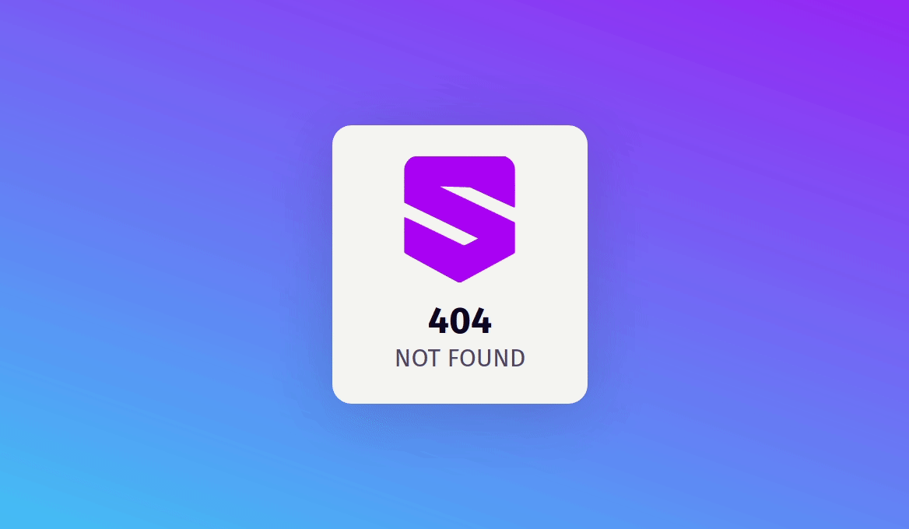

# Shortr 🚀
**`Simple, but blazingly fast, url shortener in various languages and frameworks`**


_**Note:** this is just a simple service to learn various languages and frameworks. Efficiency nor security or mantainabilty are the main intention in this project._

## Languages
- **`Golang`**
    - **[Echo](go/echo)** 
- **`JavaScript`**
    - **[Express](js/express)** 
- **`TypeScript`**
    - **[Deno](ts/deno)** 
- **`Python`**
    - **[FastApi](py/fastapi)** 
- **`Rust`**
    - **[Actix-Web](rs/actix)** 

## Screenshots




## Features

- **🚀 `SIMPLE, FAST AND ROBUST`**
- **✨ `CUSTOM OR RANDOM UNIQUE URLS (ACCEPTS UNICODE, SPACES... EVEN EMOJIS! 🔝)`**
- **🌺 `BEAUTIFUL BY DEFAULT AND CUSTOMIZABLE`**
- **🛡️ `AUTOMATIC-SSL READY`**
- **🏗️ `CONTAINERIZED AND EASY TO DEPLOY`**
- **📱 `RESPONSIVE`**
- **🍃 `LIGHTWEIGHT, BUILT-IN CACHE AND HA`**
- **😃 `SEO FRIENDLY AND CUSTOM LINK PREVIEWS`**

## Setup
- Install:
    - [`docker 19.03.6 >=`](https://docs.docker.com/get-docker/)
    - [`docker-compose 1.21.0 >=`](https://docs.docker.com/compose/install/)
- Run `make $language/$framework` ( for example `go/echo` )

**_Important_** as all WS containers map to port 80, in order to run another language/framework run `make stop` and then `make $language/$framework`.
See [`makefile`](makefile) for further commands.

## Usage
Use the frontend [`localhost`](http://localhost) or interact directly with the shorterner via API calls described below.

## API
### `GET` <span style="color: #607D8B; font-weight: normal; font-size: 0.8em;">/<span/>
#### Request
```
Nothing
```
#### Response
- **`default`**
    ```
    Serves /static
    ```

### `GET` <span style="color: #607D8B; font-weight: normal; font-size: 0.8em;">/:name<span/>
#### Request
- **`path param`** _`name`_
#### Response
- **`default`**
    ```
    Redirects to url specified by name
    HTTP code 307 in order not to get urls cached by browsers
    ```
- **`error default`**
    ```
    Serves 404.html page
    ```
- **`error application/json`**
    ```javascript
    {
        "message": "error message"
    }
    ```

### `POST` <span style="color: #607D8B; font-weight: normal; font-size: 0.8em;">/:name?url=:url<span/>
#### Request
- **`path param`** _`name`_ **`nullable`**
- **`query param`** _`url`_
#### Response
- **`default`**
    ```javascript
    {
        "id": 33,
        "name": "shortr",
        "url": "https://github.com/neoxelox/shortr",
        "hits": 1,
        "last_hit_at": "2020-07-27T00:50:42.027431Z", // ( or null )
        "created_at": "2020-07-26T23:36:14.896767Z",
        "modified_at": "2020-07-26T23:36:14.900672Z"
    }
    ```
- **`error default`**
    ```javascript
    {
        "message": "error message"
    }
    ```


### `DELETE` <span style="color: #607D8B; font-weight: normal; font-size: 0.8em;">/:name<span/>
#### Request
- **`path param`** _`name`_
#### Response
- **`default`**
    ```javascript
    {
        "id": 33,
        "name": "shortr",
        "url": "https://github.com/neoxelox/shortr",
        "hits": 1,
        "last_hit_at": "2020-07-27T00:50:42.027431Z", // ( or null )
        "created_at": "2020-07-26T23:36:14.896767Z",
        "modified_at": "2020-07-26T23:36:14.900672Z"
    }
    ```
- **`error default`**
    ```javascript
    {
        "message": "error message"
    }
    ```

### `PUT` <span style="color: #607D8B; font-weight: normal; font-size: 0.8em;">/:name?url=:url<span/>
#### Request
- **`path param`** _`name`_
- **`query param`** _`url`_
#### Response
- **`default`**
    ```javascript
    {
        "id": 33,
        "name": "shortr",
        "url": "https://github.com/neoxelox/shortr",
        "hits": 1,
        "last_hit_at": "2020-07-27T00:50:42.027431Z", // ( or null )
        "created_at": "2020-07-26T23:36:14.896767Z",
        "modified_at": "2020-07-26T23:36:14.900672Z"
    }
    ```
- **`error default`**
    ```javascript
    {
        "message": "error message"
    }
    ```

### `GET` <span style="color: #607D8B; font-weight: normal; font-size: 0.8em;">/:name/stats<span/>
#### Request
- **`path param`** _`name`_
#### Response
- **`default`**
    ```
    Serves stats.<renderer>.html page
    ```
- **`application/json`**
    ```javascript
    {
        "id": 33,
        "name": "shortr",
        "url": "https://github.com/neoxelox/shortr",
        "hits": 1,
        "last_hit_at": "2020-07-27T00:50:42.027431Z", // ( or null )
        "created_at": "2020-07-26T23:36:14.896767Z",
        "modified_at": "2020-07-26T23:36:14.900672Z"
    }
    ```
- **`error default`**
    ```
    Serves 404.html page
    ```
- **`error application/json`**
    ```javascript
    {
        "message": "error message"
    }
    ```

### `GET` <span style="color: #607D8B; font-weight: normal; font-size: 0.8em;">/health<span/>
#### Request
```
Nothing
```
#### Response
- **`default`**
    ```
    OK
    ```
- **`error default`**
    ```javascript
    {
        "message": "error message"
    }
    ```

### `ERROR` <span style="color: #607D8B; font-weight: normal; font-size: 0.8em;">/*<span/>
#### Request
```
Any
```
#### Response
- **`default if template`**
    ```
    Serves <code>.html page
    ```
- **`application/json`**
    ```javascript
    {
        "message": "error message"
    }
    ```

## Database
The project uses the latest Postgres version available and automatically initializes a pgadmin4 instance [`localhost:5433`](http://localhost:5433) to navigate through the database. Default user and password is `admin`. The server group is called `URLs` and the default database password is `postgres`.

## Model
```yaml
URL:
    id:          integer
    name:        string
    url:         string
    hits:        integer
    last_hit_at: datetime   nullable
    created_at:  datetime
    modified_at: datetime
```

## Benchmarks
The load testing tool is [Locust](https://github.com/locustio/locust) using 1 master and 4 worker containers, which are automatically created. All follow the [locustfile](locustfile.py) with `2500` users cap and a `25` spawn rate.
The benchmark must not be taken as _fully good_ comparison, but gives a quick overview at language and framework efficiency for this purpose.

The minimum number of simultaneous files open for Locust to work is `10000`. You can check your SO's default using `ulimit -Sn` and then increasing it with `ulimit -S -n 10000`.

The benchmark was run on (`sudo lshw -short`):
```
H/W path         Device           Class          Description
============================================================
                                  system         MS-7B29 (Default string)
/0                                bus            H310M PRO-VDH (MS-7B29)
/0/39/0                           memory         8GiB DIMM DDR4 Synchronous 2667 MHz (0,4 ns)
/0/39/2                           memory         8GiB DIMM DDR4 Synchronous 2667 MHz (0,4 ns)
/0/46                             processor      Intel(R) Core(TM) i5-8400 CPU @ 2.80GHz
/0/100/1/0                        display        GM206 [GeForce GTX 960]
```

### `Mixed API usage`
| Language | Framework | Mean requests per second | Maximum requests per second | Slowest request |
|:--------:|:---------:|:------------------------:|:---------------------------:|:---------------:|
|    Go    |    Echo   |         6850 rps         |           7050 rps          |      810 ms     |

## Contribute
Feel free to contribute to this project by adding more languages/frameworks, the only requirement is that it has to provide the minimum endpoints described above : ) .

## License
This project is licensed under the [MIT License](https://opensource.org/licenses/MIT) - read the [LICENSE](LICENSE) file for details.